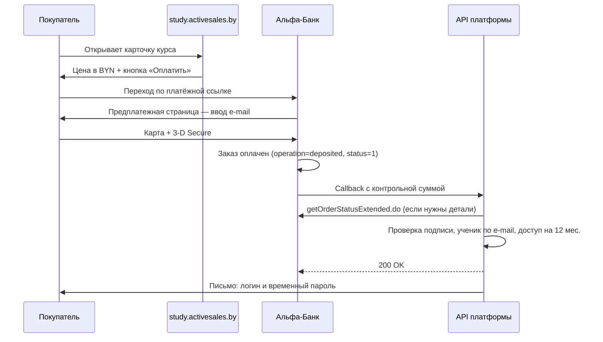
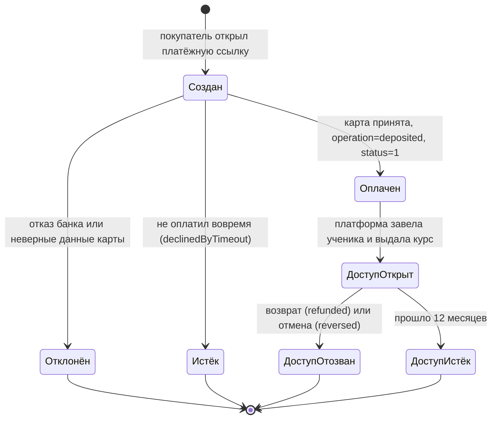
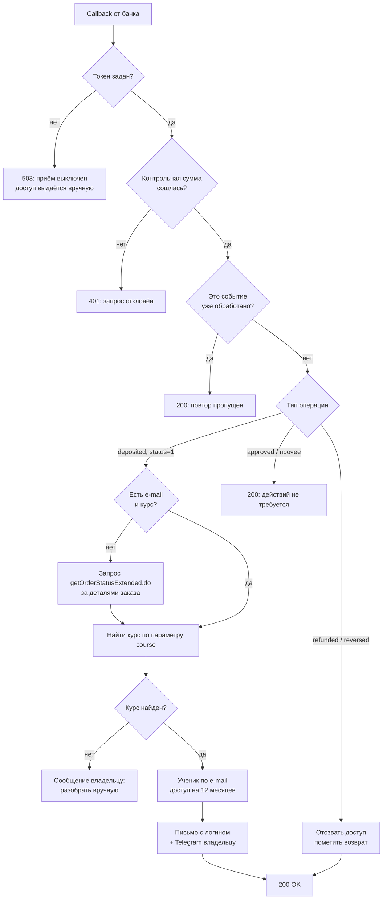
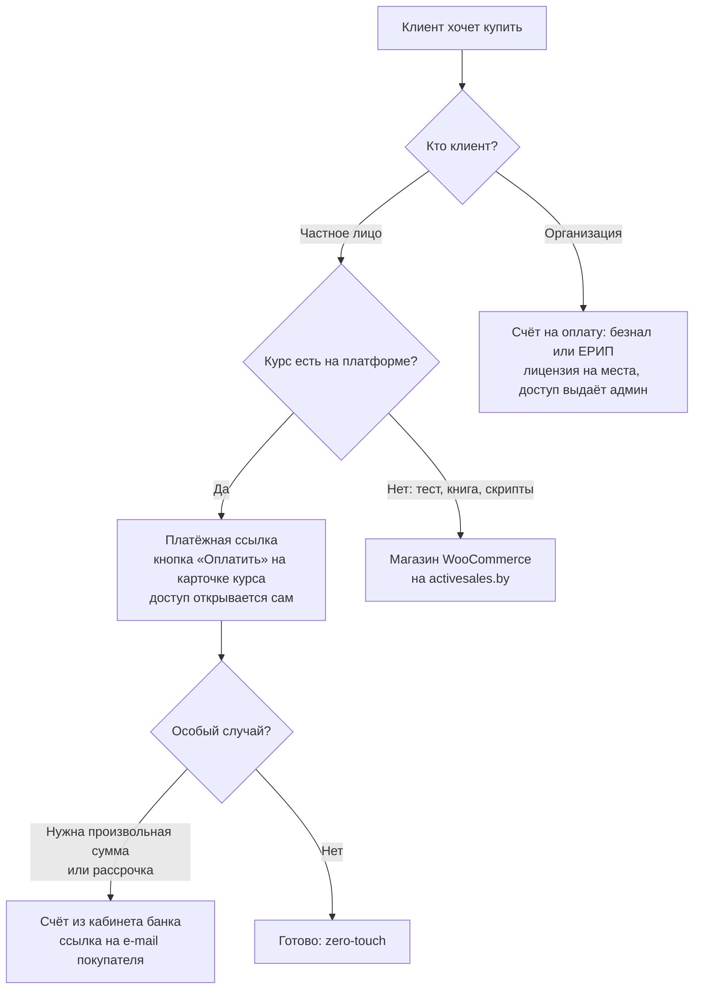

# Оплата курсов ссылками Альфа-Банка

> **Кому:** владельцу платформы (работа в личном кабинете эквайринга) и разработчику.
> **Что делаем:** на карточке курса появляется кнопка «Оплатить». Она ведёт на платёжную
> ссылку, созданную в личном кабинете Альфа-Банка: покупатель вводит e-mail, платит картой на
> странице банка, а платформа получает уведомление и **сама** открывает доступ к курсу.
> Ни WordPress, ни подрядчик в этом не участвуют.
>
> Редакция 1.0 от 18 августа 2026 г. Основано на документации песочницы Альфа-Банка:
> [личный кабинет](https://sandbox.alfabank.by/sandbox/ru/integration/mportal3/mp3.html),
> [callback-уведомления](https://sandbox.alfabank.by/sandbox/ru/integration/api/rest.html#callback-notifications),
> [тестовые карты](https://sandbox.alfabank.by/sandbox/ru/integration/structure/test-cards.html).
>
> Альтернативный путь (продажа через магазин на `activesales.by`) описан в
> [WOO-INTEGRATION.md](WOO-INTEGRATION.md) и остаётся запасным каналом.

---

## 1. Почему именно платёжные ссылки

| | Ссылки банка | Магазин WooCommerce | Полная интеграция сайта |
|---|---|---|---|
| Договор эквайринга | действующий, менять не нужно | действующий | нужен новый на `study.*` |
| Требования банка к сайту (сервер в РБ, домен 2-го уровня) | не затрагиваются: платёж на домене банка | выполнены на `activesales.by` | **не выполняются** |
| Переходов до оплаты | 1 | 2 | 1 |
| Зависимость от WP-подрядчика | нет | есть | нет |
| Персональные данные | только e-mail | Woo собирает имя и телефон | только e-mail |
| Работа на нашей стороне | приём callback | сделано | чекаут + `register.do` |

Платёжная ссылка — штатный способ приёма оплаты по уже действующему договору: её рассылают в
мессенджерах, отправляют письмом, печатают в виде QR-кода. Размещение такой ссылки кнопкой на
сайте ничем принципиально не отличается от отправки её клиенту в переписке — сам платёж
происходит на домене банка.

---

## 2. Как это работает

### 2.1. Схема

```
┌───────────────────────────────┐
│  study.activesales.by         │
│  Карточка курса               │
│  «Эффективные продажи кухонь» │
│  590 Br   [ Оплатить ]        │
└──────────────┬────────────────┘
               │ 1. переход по платёжной ссылке
               ▼
┌───────────────────────────────┐
│  Предплатежная страница банка │
│  Покупатель вводит e-mail     │
└──────────────┬────────────────┘
               │ 2.
               ▼
┌───────────────────────────────┐
│  Страница оплаты банка        │
│  Карта + 3-D Secure           │
└──────────────┬────────────────┘
               │ 3. успешная оплата
               ▼
┌───────────────────────────────────────────────────────────┐
│  Callback банка → study.activesales.by/api/payments/alfa   │
│  ├─ проверка контрольной суммы (HMAC-SHA256)               │
│  ├─ если e-mail и курс не пришли — запрос                  │
│  │   getOrderStatusExtended.do за деталями заказа          │
│  ├─ защита от повторов                                     │
│  ├─ ученик по e-mail + доступ к курсу на 12 месяцев        │
│  └─ письмо покупателю + сообщение владельцу в Telegram     │
└──────────────┬────────────────────────────────────────────┘
               │ 4.
               ▼
     Покупатель входит в кабинет и учится
```

### 2.2. То же в виде mermaid



### 2.3. Пошагово словами

1. Посетитель видит на карточке курса цену и кнопку **«Оплатить»**.
2. Кнопка ведёт на постоянную платёжную ссылку этого курса (создаётся один раз в кабинете).
3. Банк показывает предплатежную страницу: покупатель вводит **e-mail** — по нему платформа
   заведёт учётную запись.
4. Дальше — страница оплаты банка: карта, 3-D Secure. Карточные данные к нам не попадают.
5. После списания банк отправляет **callback** на платформу с контрольной суммой.
6. Платформа проверяет подпись, определяет курс, заводит ученика, открывает доступ на 12 месяцев
   и отправляет письмо с логином и временным паролем. Владелец получает сообщение в Telegram.

### 2.4. Карта систем: кто где живёт

```
        ┌──────────────────────────────────────────────────────────────┐
        │                    ЧТО ВИДИТ ПОКУПАТЕЛЬ                      │
        └──────────────────────────────────────────────────────────────┘

   study.activesales.by            ecom.alfabank.by             почта
   ┌────────────────────┐        ┌────────────────────┐    ┌────────────┐
   │ Витрина курсов     │        │ Предплатежная      │    │ Письмо     │
   │ Кнопка «Оплатить»  │───────►│ страница (e-mail)  │    │ с логином  │
   │ Личный кабинет     │        │ Страница оплаты    │    │ и паролем  │
   │ ученика            │        │ 3-D Secure         │    └─────▲──────┘
   └─────────┬──────────┘        └─────────┬──────────┘          │
             │                             │                     │
        ┌────┴─────────────────────────────┴─────────────────────┴────┐
        │                    ЧТО РАБОТАЕТ СКРЫТО                      │
        └─────────────────────────────────────────────────────────────┘

   Платформа (VPS)                 Платёжный шлюз            Личный кабинет
   ┌────────────────────┐        ┌────────────────────┐    ┌────────────────┐
   │ /api/payments/alfa │◄───────│ Callback           │    │ Ссылки         │
   │ проверка подписи   │        │ (HTTPS:443, POST)  │    │ на оплату      │
   │ выдача доступа     │───────►│ getOrderStatus…    │    │ Транзакции     │
   │ PostgreSQL         │        │ Возвраты           │    │ Возвраты       │
   └────────────────────┘        └────────────────────┘    └────────────────┘
        наш сервер                   сервер банка            рабочее место
                                                               владельца

   Карточные данные существуют ТОЛЬКО в правой колонке — на стороне банка.
   Платформа не видит и не хранит их ни на одном шаге.
```

### 2.5. Жизненный цикл платежа и доступа



| Состояние | Что видит покупатель | Что видит владелец |
|---|---|---|
| Создан | платёжная страница банка | транзакция в кабинете, статус «Создан» |
| Оплачен | страница успешной оплаты | статус «Завершён», сообщение в Telegram |
| Доступ открыт | письмо с логином, курс в кабинете | доступ в `/admin/students` |
| Отклонён | сообщение об ошибке банка | транзакция со статусом отказа |
| Доступ отозван | курс пропал из кабинета | отметка о возврате |

### 2.6. Как платформа обрабатывает уведомление



---

### 2.7. Как платформа узнаёт, какой именно курс оплачен

Главное, что нужно понять: **платёжная ссылка у каждого курса своя**. Это не общая «страница
оплаты», а созданный в банке объект, к которому намертво привязаны сумма и набор параметров.

```
   Ссылка №1 «Кухни»            Ссылка №2 «Туризм»           Ссылка №3 «Обувь»
   ├ сумма: 590 BYN             ├ сумма: 490 BYN             ├ сумма: 350 BYN
   ├ course = sales-kitchens    ├ course = sales-tourism     ├ course = sales-shoes
   └ спросить e-mail            └ спросить e-mail            └ спросить e-mail
```

`course` — это «свой параметр» с фиксированным значением, который заводится при создании ссылки
(раздел 6.2). Покупатель его не видит и изменить не может: параметр просто едет вместе с
платежом. Поэтому **курс выбирается в момент клика, а не в момент оплаты** — нажал «Оплатить» на
карточке кухонь, попал на ссылку №1, и всё дальнейшее уже помечено как `sales-kitchens`.

#### Разбор одного платежа

```
1. Клик на карточке курса «Кухни» → переход на ссылку №1

2. Предплатежная страница банка: покупатель вводит ivanov@mail.by
   Банк создаёт заказ №30412 и цепляет к нему:
        сумма  = 590.00 BYN
        course = sales-kitchens      ← из настроек ссылки
        e-mail = ivanov@mail.by      ← ввёл покупатель

3. Оплата картой прошла

4. Банк присылает уведомление на study.activesales.by/api/payments/alfa
        mdOrder     = 3ff6962a-7dcc-…    (номер заказа в банке)
        orderNumber = 30412
        operation   = deposited          (деньги списаны)
        status      = 1                  (успешно)
        checksum    = DBBE9E54D420…      (подпись)

5. Платформа проверяет подпись — убеждается, что уведомление действительно от банка

6. Запрашивает карточку заказа: getOrderStatusExtended.do?orderId=3ff6962a-7dcc-…
        → course = sales-kitchens, e-mail = ivanov@mail.by, сумма 590

7. Находит в базе курс со slug = sales-kitchens → «Эффективные продажи кухонь 2.0»
   Находит ученика по ivanov@mail.by → нет такого → создаёт
   Открывает доступ на 12 месяцев, отправляет письмо с временным паролем
```

Шаг 6 нужен потому, что штатное уведомление банка короткое: номер заказа, тип операции и
подпись. Детали заказа — наши параметры и e-mail — добираются одним запросом по номеру. Если
банк включит эти поля прямо в уведомление (пункт 3 письма из раздела 4), шаг 6 отпадёт;
платформа поддерживает оба варианта.

#### Частые вопросы

**Нельзя ли определять курс по сумме платежа?** Нет. Обувь, недвижимость и курс для медпредов
стоят одинаково — по 350 BYN. Сумма курс не различает, а параметр `course` различает всегда.

**Что если покупатель получил ссылку в мессенджере, а не перешёл с сайта?** Сработает точно так
же: курс определяется самой ссылкой, а не тем, откуда по ней пришли. Это плюс — одну и ту же
ссылку можно отправить клиенту в переписке, разместить в соцсетях или напечатать QR-кодом на
визитке, и доступ всё равно откроется автоматически.

**Можно ли подделать уведомление об оплате?** Нет. Каждое уведомление подписано токеном, который
знают только банк и наш сервер (раздел 12). Платформа пересобирает подпись у себя и сравнивает;
не совпало — запрос отклоняется с ошибкой 401. Кроме того, обработанные заказы запоминаются,
поэтому повторная отправка того же уведомления второй доступ не создаст.

**Что будет, если покупатель ошибётся в e-mail?** Доступ откроется на тот адрес, который он
ввёл. Владелец видит каждую оплату в Telegram, а сам заказ — в кабинете банка, поэтому адрес
можно поправить в админке и переслать доступ вручную.

#### Следствие: один платёж — один курс

Раз сумма зашита в ссылку, за один платёж покупается ровно один курс. Корзины «беру три курса
сразу» в этой схеме нет — курсы оплачиваются по очереди. Если понадобится продавать пакет, под
него делается отдельная ссылка со своей суммой и своим значением параметра, например
`course = bundle-retail`, а на платформе — правило, какие курсы этот пакет открывает.

---

---

## 3. Дорожная карта: семь шагов

```
 ШАГ 0            ШАГ 1          ШАГ 2           ШАГ 3          ШАГ 4
 Запрос           Вход в         Создать         Настроить      Передать
 в банк     ───►  кабинет  ───►  8 ссылок  ───►  callback  ───► токен и
 (права)          (тест)         на курсы        и токен        SMTP
   │                                                              │
   │  ecommerce@alfa-bank.by                    разработчику ◄────┘
   │                                                              │
   ▼                                                              ▼
 ответ банка                                              ШАГ 5   Прописать
 про права и SSL                                                  ссылки
                                                                  в админке
                                                                     │
     ШАГ 7                        ШАГ 6                              │
     Боевая среда         ◄───    Тестовая оплата           ◄────────┘
     ├ договор                    ├ карта 4111 1111 1111 1111
     ├ пересоздать ссылки         ├ письмо с паролем пришло
     ├ новый токен                ├ курс открылся
     └ реальная покупка           └ возврат закрыл доступ
       и возврат
```

| Шаг | Кто делает | Время | Блокирует следующий? |
|---|---|---|---|
| 0. Запрос прав у банка | владелец | 1–3 рабочих дня | да, шаги 2 и 3 |
| 1. Вход в кабинет | владелец | 10 минут | нет |
| 2. Создать ссылки | владелец | ~30 минут на 8 курсов | да, шаг 5 |
| 3. Настроить callback | владелец | 15 минут | да, шаг 6 |
| 4. Передать токен и SMTP | владелец → разработчик | 5 минут | да, шаг 6 |
| 5. Прописать ссылки в админке | владелец | 15 минут | да, шаг 6 |
| 6. Тестовая оплата | вместе | 1 час | да, шаг 7 |
| 7. Боевая среда | владелец + банк | по срокам банка | — |

---

## 4. Шаг 0. Что запросить у банка перед началом

Раздел «Ссылки на оплату» и раздел «Callback уведомления» доступны **только при наличии прав** и
у части мерчантов скрыты. Написать на `ecommerce@alfa-bank.by` (или спросить у сопровождающего
специалиста):

> Здравствуйте!
>
> Мерчант: `study.activesales.by_BJHDIZCC518MN9OLBFQZ` (ИП Дубовик В. Н., УНП 191828253).
>
> Просим:
> 1. Включить для нашей учётной записи функционал **«Ссылки на оплату»** (шаблоны платёжных
>    ссылок) — планируем продавать онлайн-курсы фиксированной стоимости по постоянным ссылкам.
> 2. Открыть в личном кабинете раздел **«Настройки → Мерчант → Callback уведомления»**, чтобы мы
>    могли самостоятельно указать адрес уведомлений и сгенерировать токен симметричной подписи.
> 3. Подтвердить, что в callback-уведомление можно включить **адрес электронной почты
>    плательщика** и **пользовательские параметры заказа**. Если это невозможно, подтвердите, что
>    эти данные доступны в ответе `getOrderStatusExtended.do`.
> 4. Уточнить, поддерживает ли платёжный шлюз доставку callback на сайты с TLS-сертификатом
>    **Let's Encrypt** (в требованиях перечислены другие удостоверяющие центры).
>
> С уважением, …

Пункт 4 важен: в требованиях к SSL названы Thawte, VeriSign, DigiCert, COMODO, GeoTrust,
GlobalSign, Trustis, UniTrust, GoDaddy. Let's Encrypt в списке нет, хотя список подан как
примерный. Если шлюз не примет наш сертификат, уведомления просто не дойдут — лучше выяснить
заранее, чем ловить это на боевых платежах.

---

## 5. Шаг 1. Вход в личный кабинет

| Среда | Адрес | Учётные данные |
|---|---|---|
| Тестовая | `https://abby.rbsuat.com/mportal3/auth/login` | логин `study.activesales.by_BJHDIZCC518MN9OLBFQZ-operator`, пароль из письма банка |
| Боевая | `https://ecom.alfabank.by/generalmp3/login` | выдаются после заключения договора |

Всё, что описано ниже, сначала делается **в тестовом кабинете**. Ссылки и настройки тестовой
среды в боевой не работают — после перехода в бой их придётся создать заново (см. раздел 11).

Рекомендуется сразу включить двухфакторную аутентификацию: **Настройки → Двухфакторная
аутентификация → Google Authenticator**. Кабинет управляет деньгами, пароля мало.

---

### 5.1. Что где лежит в личном кабинете

```
Личный кабинет эквайринга
│
├── Ссылки на оплату ......... ШАГ 2: создать по одной ссылке на курс
│   ├── Создать
│   ├── Копировать / QR-код / Поделиться
│   └── Деактивировать, удалить, редактировать
│
├── Настройки
│   ├── Мерчант
│   │   └── Callback уведомления ... ШАГ 3: адрес платформы + токен подписи
│   ├── Основные настройки
│   └── Двухфакторная аутентификация ... включить сразу
│
├── Работа с транзакциями .... ШАГ 6: проверка тестовой оплаты
│   └── Подробные сведения → Детали, Активность, Возврат
│
├── Счета на оплату .......... ручное выставление счёта (запасной канал)
├── Отчёты, Аналитика ........ сверка выручки
└── Каталог товаров, Домены, Генератор кода ... не используем
```

## 6. Шаг 2. Создать платёжную ссылку для каждого курса

**Личный кабинет → Ссылки на оплату → Создать** (или кнопка «Создать» вверху → «Ссылку на
оплату»).

### 6.1. Основные поля

| Поле | Что ставим | Почему |
|---|---|---|
| Название | название курса, например «Эффективные продажи кухонь 2.0» | видно только продавцу, по нему ищем ссылку в списке |
| Описание | `курс sales-kitchens, доступ 12 месяцев` | видно только продавцу |
| Тип оплаты | **Одностадийная** | услуга выдаётся сразу, удерживать средства незачем |
| Язык | RU | язык платёжной страницы |
| Ограничение | **Без ограничений** | ссылка постоянная: одна на курс, работает всегда |
| Сумма | цена курса из таблицы 6.3 | фиксированная, покупатель изменить не может |
| Валюта | BYN | по настройкам мерчанта |

### 6.2. Дополнительные параметры (раздел «Дополнительные параметры»)

| Параметр | Значение | Обязательный |
|---|---|---|
| Электронная почта | **включить** | **да** — без e-mail платформа не сможет открыть доступ |
| ФИО | выключить | имя нам не нужно (минимизация персональных данных) |
| Телефон | выключить | не нужен |
| Адрес | выключить | услуга электронная, доставки нет |

Затем нажать **«Добавить параметр»** и завести свой параметр — по нему платформа поймёт, какой
курс оплачен:

| Поле формы | Значение |
|---|---|
| Имя параметра | `course` (только латиница и подчёркивание) |
| Заголовок поля | Курс |
| Значение | **Фиксированное** → адрес курса из таблицы 6.3 (например `sales-kitchens`) |
| Отображать в PDF-квитанции | по желанию |
| Обязательное поле | не требуется (значение фиксированное) |

Нажать **«Создать»**. Ссылка появится в списке со статусом **Активна**. Через меню строки:
**Копировать** — получить URL, **Скачать QR-код** — если понадобится офлайн-канал.

### 6.3. Таблица ссылок, которые нужно создать

| Курс | Значение параметра `course` | Сумма | Название ссылки |
|---|---|---|---|
| Эффективные продажи кухонь 2.0 | `sales-kitchens` | 590 BYN | Курс «Эффективные продажи кухонь 2.0» |
| Техники продаж в туризме | `sales-tourism` | 490 BYN | Курс «Техники продаж в туризме» |
| B2B-переговоры и крупные сделки | `sales-b2b` | 490 BYN | Курс «B2B-переговоры и крупные сделки» |
| Продажи в магазине обуви и одежды | `sales-shoes` | 350 BYN | Курс «Продажи обуви и одежды» |
| Техники продаж недвижимости | `sales-realty` | 350 BYN | Курс «Техники продаж недвижимости» |
| Активные продажи для медицинских представителей | `sales-pharma` | 350 BYN | Курс «Продажи для медпредставителей» |
| Тайм менеджмент: базовые принципы | `time-management` | 320 BYN | Курс «Тайм менеджмент» |
| СПИН-продажи: как формировать потребность | `sales-spin` | 250 BYN | Курс «СПИН-продажи» |

> **Важно про цены.** Сумма зашита в ссылку на стороне банка. Если цена курса меняется в админке
> платформы, ссылку нужно отредактировать в кабинете — иначе покупатель заплатит старую цену.
> Платформа будет показывать предупреждение о расхождении, но менять сумму в банке она не может.

---

## 7. Шаг 3. Настроить callback-уведомления

**Настройки → Мерчант → Callback уведомления** → включить переключатель «Callback уведомления
выключены».

| Настройка | Значение |
|---|---|
| Callback метод | **POST** |
| Ссылка | `https://study.activesales.by/api/payments/alfa` |
| Тип подписи | **Симметричный** |
| Токен | нажать **«Сгенерировать»**, скопировать и сохранить в менеджере паролей |
| Дополнительные параметры | отметить **e-mail** и пользовательские параметры заказа (если такие пункты доступны) |
| Операции | `approved`, `deposited`, `reversed`, `refunded`, `declinedByTimeout` |

Пояснение по операциям:

| Операция | Что означает | Что делает платформа |
|---|---|---|
| `deposited` + `status=1` | деньги списаны | открыть доступ к курсу |
| `approved` + `status=1` | средства захолдированы (двухстадийная оплата) | ничего, ждём `deposited` |
| `refunded` | возврат средств | отозвать доступ |
| `reversed` | платёж отменён | отозвать доступ |
| `declinedByTimeout` | покупатель не оплатил вовремя | ничего |

Уведомления доставляются **только на порт 443 по HTTPS**. Если платформа отвечает не `200 OK`,
банк повторяет отправку с интервалом 30 секунд, максимум три раза подряд.

---

## 8. Шаг 4. Передать данные на платформу

После шагов 2–3 у вас на руках: токен callback и (по желанию) данные API-учётки из письма банка.
Прописываются в окружение платформы:

```
# Приём уведомлений об оплате
ALFA_CALLBACK_TOKEN=<токен, сгенерированный в кабинете>

# Доступ к API шлюза — чтобы добрать детали заказа, если их нет в callback
ALFA_API_URL=https://abby.rbsuat.com/payment/rest/      # тест
# ALFA_API_URL=https://ecom.alfabank.by/payment/rest/   # бой
ALFA_API_LOGIN=study.activesales.by_BJHDIZCC518MN9OLBFQZ-api
ALFA_API_PASSWORD=<пароль API-учётки из письма банка>

# Почта для писем ученикам
EMAIL_ENABLED=true
SMTP_HOST=<сервер почты>
SMTP_PORT=465
SMTP_USER=noreply@activesales.by
SMTP_PASSWORD=<пароль ящика>
SMTP_FROM=noreply@activesales.by
```

Пока `ALFA_CALLBACK_TOKEN` не задан, приём уведомлений выключен: эндпоинт отвечает `503`, а
доступы выдаются вручную, как сейчас.

---

## 9. Шаг 5. Прописать ссылки в админке платформы

Для каждого курса: **`/admin/courses/<курс>` → поле «Ссылка на оплату»** → вставить URL,
скопированный в шаге 2, → сохранить.

После этого на карточке курса вместо «Оставить заявку» появляется кнопка **«Оплатить»**, которая
ведёт по этой ссылке. Курс без заполненной ссылки продолжает продаваться через форму заявки —
ничего не ломается.

Кнопка показывается только на белорусском домене `study.activesales.by`. На `.kz` и `.ru`
остаётся заявка: платёжная страница работает в белорусских рублях, а расчёты в этих странах
устроены иначе.

---

## 10. Шаг 6. Тестовая оплата

Тестовые карты песочницы:

| Номер карты | CVC | Срок | Результат |
|---|---|---|---|
| `4111 1111 1111 1111` | 123 | 12/26 | успешная оплата, 3-D Secure без запроса кода |
| `6390 0200 0000 000003` | 123 | 12/34 | успешная оплата, код 3-D Secure `12345678` |
| `4111 1111 1111 1111` | **неверный CVC** | 12/26 | отказ `(71015) Decline. Input error` |

Что проверить:

| № | Шаг | Ожидаемый результат |
|---|---|---|
| 1 | Открыть платёжную ссылку курса | Открылась предплатежная страница с полем e-mail |
| 2 | Ввести e-mail, оплатить тестовой картой | Страница успешной оплаты |
| 3 | Личный кабинет → Работа с транзакциями | Транзакция со статусом «Завершён» (deposited) |
| 4 | В деталях транзакции | Виден параметр `course` с адресом курса |
| 5 | Почта покупателя | Пришло письмо с логином и временным паролем |
| 6 | Вход на платформе | Пароль работает, система просит сменить его |
| 7 | Кабинет ученика | Курс открыт, уроки играют |
| 8 | Личный кабинет → возврат по транзакции | Доступ к курсу у ученика закрылся |

**Отдельно посмотреть в шаге 3–4, в каком поле пришёл e-mail покупателя** — в самом callback или
только в ответе `getOrderStatusExtended.do`. От этого зависит, нужен ли платформе запрос к API;
сообщите результат разработчику.

---

## 11. Шаг 7. Переход в боевую среду

1. Сообщить банку на `ecommerce@alfa-bank.by`, что интеграция выполнена и тестовая оплата
   проведена (это третий шаг из письма о подключении).
2. Заключить договор, получить боевые доступы к кабинету и API.
3. **Создать платёжные ссылки заново в боевом кабинете** — тестовые в бою не работают.
4. Заново настроить callback в боевом кабинете и сгенерировать новый токен.
5. Обновить окружение платформы: боевые `ALFA_API_URL`, логин, пароль, токен.
6. Заменить ссылки в админке курсов на боевые.
7. Провести **одну реальную покупку своей картой** на недорогом курсе и оформить по ней возврат —
   так проверяются обе стороны цикла на настоящих деньгах.

---

## 12. Как платформа проверяет подлинность уведомления

Техническая справка; настраивать по ней ничего не нужно.

Банк присылает параметры заказа и контрольную сумму, посчитанную общим токеном.

```
Пришло от банка:
  amount=59000  mdOrder=3ff6962a-7dcc-…  operation=deposited
  orderNumber=10747  status=1  checksum=DBBE9E54D42072D8CAF32C7F66…
        │
        │ 1. отложить checksum, выбросить sign_alias
        ▼
  amount=59000  mdOrder=3ff6962a-…  operation=deposited  orderNumber=10747  status=1
        │
        │ 2. отсортировать по имени параметра (A→Я) и склеить через «;»
        ▼
  amount;59000;mdOrder;3ff6962a-…;operation;deposited;orderNumber;10747;status;1;
        │                                                                      ▲
        │                                          точка с запятой в конце ────┘
        │ 3. HMAC-SHA256 этой строки на токене из кабинета → ВЕРХНИЙ РЕГИСТР
        ▼
  DBBE9E54D42072D8CAF32C7F66…
        │
        │ 4. сравнить с отложенным checksum
        ▼
   совпало → уведомление подлинное      не совпало → 401, запрос отклонён
```

Дополнительно платформа сверяет `operation` и `status`: доступ открывается только при
`operation=deposited` и `status=1`.

Дополнительно платформа хранит журнал обработанных уведомлений: повторная доставка того же
события не создаёт второго ученика, второго доступа и второго письма.

---

## 13. Ограничения, о которых нужно помнить

| Ограничение | Следствие | Что делать |
|---|---|---|
| Сумма зашита в ссылку | цена курса и цена в банке могут разойтись | менять цену в двух местах; платформа предупредит о расхождении |
| Ссылка постоянная и публичная | по ней может заплатить кто угодно, в том числе повторно | это нормально: доступ выдаётся на e-mail, указанный при оплате |
| E-mail вводит сам покупатель | опечатка → письмо уйдёт не туда | владелец видит каждую оплату в Telegram и может поправить адрес в админке |
| Ссылки создаются вручную | новый курс = новая ссылка | добавить пункт в процедуру публикации курса |
| Callback только на HTTPS:443 | сертификат должен приниматься шлюзом | выяснить вопрос с Let's Encrypt заранее (раздел 4) |
| B2B-лицензии | ссылками не продаются | остаются по счёту: безналичный расчёт и ЕРИП |

---

## 14. Итоговый чек-лист

- [ ] Банк включил «Ссылки на оплату» и раздел Callback-уведомлений
- [ ] Получен ответ про поддержку сертификата Let's Encrypt
- [ ] В тестовом кабинете включена двухфакторная аутентификация
- [ ] Созданы 8 платёжных ссылок с параметром `course` и обязательным e-mail
- [ ] Настроен callback: POST, адрес платформы, симметричная подпись, токен сохранён
- [ ] Токен и данные API переданы разработчику, окружение заполнено
- [ ] Заведён почтовый ящик `noreply@activesales.by`, SMTP настроен
- [ ] Ссылки прописаны в админке курсов
- [ ] Тестовая оплата прошла все 8 пунктов проверки
- [ ] Банку сообщено о готовности, договор заключён
- [ ] Ссылки и callback пересозданы в боевом кабинете
- [ ] Проведена реальная покупка и возврат

---

## 15. Какой канал оплаты для какого случая

После запуска у платформы будет несколько способов принять деньги. Схема выбора:



| Канал | Когда | Автоматическая выдача доступа |
|---|---|---|
| Платёжная ссылка курса | розничная продажа курса с сайта | да |
| Счёт из кабинета банка | нестандартная сумма, оплата по договорённости | нет, доступ выдаёт владелец |
| Безналичный расчёт, ЕРИП | организации, B2B-лицензии | нет, доступ выдаёт владелец |
| Магазин WooCommerce | тесты, книги, скрипты, офлайн-тренинги | не требуется |

---

## Приложение. Что должно быть реализовано на платформе

Для справки разработчику — объём работ на нашей стороне:

| Что | Статус |
|---|---|
| `POST /api/payments/alfa` — приём callback, проверка контрольной суммы | к реализации |
| Запрос `getOrderStatusExtended.do` за деталями заказа, если e-mail не пришёл в callback | к реализации |
| Поле «Ссылка на оплату» в админке курса + предупреждение о расхождении цены | к реализации |
| Кнопка «Оплатить» на карточке курса (только белорусский домен) | к реализации |
| Выдача доступа: ученик по e-mail, `Enrollment(source=PURCHASE)`, заказ и платёж, письмо с временным паролем, отзыв при возврате | **готово** — используется общий код с каналом WooCommerce |
| Защита от повторной обработки уведомления | **готово** — журнал `WebhookEvent` |
