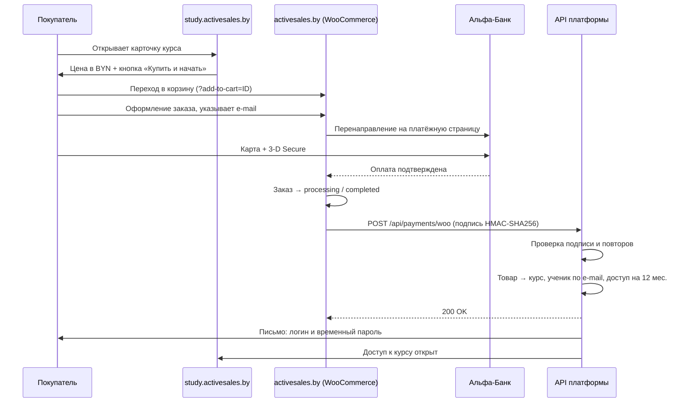

# Онлайн-оплата курсов через магазин activesales.by

> **Кому:** специалисту, обслуживающему WordPress-сайт `activesales.by`, и владельцу платформы.
> **Что делаем:** курсы платформы `study.activesales.by` продаются в существующем магазине
> WooCommerce на `activesales.by`. Покупатель платит картой (эквайринг Альфа-Банка, уже
> подключён), после оплаты магазин уведомляет платформу, и она **сама** заводит ученика и
> открывает доступ к курсу. Участие человека не требуется.
>
> Редакция 1.0 от 18 августа 2026 г.

---

## 1. Зачем именно так

Требования Альфа-Банка к интернет-ресурсу (документ «Требования банка к сайту/мобильному
приложению») и Указ Президента Республики Беларусь № 60 от 01.02.2010 предъявляют к площадке,
принимающей карточные платежи, три условия, которые платформа `study.activesales.by` сейчас
не выполняет:

| Требование банка | `activesales.by` | `study.activesales.by` |
|---|---|---|
| Сервер на территории Республики Беларусь | ✅ да (`93.125.99.134`) | ❌ нет (зарубежный VPS) |
| Домен второго уровня (`mysite.by`, не `mysite.somesite.by`) | ✅ да | ❌ третий уровень |
| Ресурс указан в договоре эквайринга, размещены логотипы платёжных систем, правила оплаты и возврата | ✅ да (страница `/payment/`) | ❌ нет |

Вывод: **платёжный контур остаётся на `activesales.by`**, платформа отвечает только за
обучение. Это не требует ни переезда платформы, ни нового договора с банком, ни интеграции с
API банка — магазин уже умеет принимать деньги, нужно лишь связать его с платформой.

**Что НЕ входит в эту работу:** корпоративные лицензии (B2B) продаются по счёту, как и раньше —
безналичный расчёт и ЕРИП. Онлайн-оплата вводится только для розничных курсов.

---

## 2. Схема потока

### 2.1. Общая схема (для диаграммы)

```
┌────────────────────────────┐        ┌─────────────────────────────┐
│  study.activesales.by      │        │  activesales.by             │
│  (витрина и обучение)      │        │  (магазин, WordPress)       │
│                            │        │                             │
│  Карточка курса ───────────┼──1────►│  Товар в корзине            │
│  кнопка «Купить и начать»  │        │         │                   │
│                            │        │         2                   │
│                            │        │         ▼                   │
│                            │        │  Оформление заказа          │
│                            │        │         │                   │
└────────────────────────────┘        └─────────┼───────────────────┘
                                                3
                                                ▼
                                   ┌────────────────────────────┐
                                   │  Платёжная страница банка  │
                                   │  (эквайринг Альфа-Банка,   │
                                   │   3-D Secure)              │
                                   └────────────┬───────────────┘
                                                4
                                                ▼
                                   ┌────────────────────────────┐
                                   │  Заказ становится          │
                                   │  «processing/completed»    │
                                   └────────────┬───────────────┘
                                                5  webhook (HMAC-SHA256)
                                                ▼
┌───────────────────────────────────────────────────────────────────┐
│  study.activesales.by/api/payments/woo                            │
│  ├─ проверка подписи                                              │
│  ├─ защита от повторов (WebhookEvent)                             │
│  ├─ товар → курс (по SKU)                                         │
│  ├─ ученик по e-mail + доступ на 12 месяцев                       │
│  └─ письмо покупателю + сообщение владельцу в Telegram            │
└───────────────────────────────┬───────────────────────────────────┘
                                6
                                ▼
                   Покупатель входит в кабинет и учится
```

### 2.2. То же в виде mermaid (если удобнее рисовать из кода)



### 2.3. Пошагово словами

1. Посетитель на `study.activesales.by/courses/<курс>` видит цену и кнопку **«Купить и начать»**.
   Кнопка ведёт на `https://activesales.by/cart/?add-to-cart=<ID товара>` — товар сразу в корзине.
2. Покупатель оформляет заказ в магазине и указывает **e-mail** (единственное обязательное поле
   для нас).
3. Магазин отправляет его на платёжную страницу банка; карточные данные на сайты не попадают.
4. После успешной оплаты заказ получает статус `processing` или `completed`.
5. Магазин отправляет уведомление (webhook) на `https://study.activesales.by/api/payments/woo`,
   подписав тело запроса общим секретом.
6. Платформа проверяет подпись, находит курс по артикулу товара, заводит ученика по e-mail из
   заказа, открывает доступ на 12 месяцев и отправляет письмо с логином и временным паролем.
   Владелец получает сообщение в Telegram.

**Время от оплаты до доступа — секунды.** Если уведомление не дошло, платформа ночью (05:00)
сама сверяется с магазином и открывает доступ по оплаченным заказам, которые пропустила.

---

## 3. Что уже сделано на стороне платформы

Работы по платформе завершены, ничего ждать не нужно:

| Что | Где |
|---|---|
| Приём уведомлений магазина | `POST /api/payments/woo` |
| Проверка подписи HMAC-SHA256 | `src/lib/payments/woo/signature.ts` |
| Разбор заказа, статусы, идемпотентность | `src/lib/payments/woo/order.ts` |
| Создание ученика, заказа, платежа и доступа | `src/lib/payments/woo/fulfill.ts` |
| Письмо покупателю и сообщение владельцу | `src/lib/payments/woo/notify.ts` |
| Ночная сверка заказов (05:00) | `src/lib/payments/woo/reconcile.ts` |
| Связь курса с товаром (поле «Товар в магазине (ID)») | админка курса `/admin/courses/<id>` |
| Кнопка «Купить и начать» на витрине | только на белорусском домене |

---

## 4. Задачи специалисту по WordPress

Ниже — полный перечень. Каждый пункт независим, порядок соблюдать необязательно, кроме 4.7
(секрет нужно передать владельцу платформы до включения приёма).

### 4.1. Проставить артикулы (SKU) товарам-курсам

Артикул — это ключ, по которому платформа понимает, какой курс оплачен. **Значения менять
нельзя**, они должны совпадать буква в букву.

| Товар в магазине | ID | Артикул (SKU) — вписать |
|---|---|---|
| Видео курс Эффективные продажи кухонь 2.0 | 23916 | `sales-kitchens` |
| Видео курс Техники продаж в туризме | 24242 | `sales-tourism` |
| Видеокурс — тренинг по деловым переговорам и продажам в B2B | 25053 | `sales-b2b` |
| Видео уроки продаж для продавцов обуви | 23743 | `sales-shoes` |
| Видео-тренинг продаж недвижимости для риэлторов | 21970 | `sales-realty` |
| Бизнес-тренинг для медицинского представителя — видео-уроки | 24589 | `sales-pharma` |
| Тайм менеджмент: базовые принципы — видео-уроки | 23093 | `time-management` |
| *(создать, см. 4.3)* СПИН-продажи | — | `sales-spin` |

Где: **Товары → выбрать товар → вкладка «Инвентарь» → поле «Артикул»**.

Остальные позиции магазина (тесты, книги, скрипты, офлайн-тренинги, чек-листы) артикулов из
этого списка получать не должны — платформа их игнорирует, и заказы на них проходят как раньше.

### 4.2. Обновить цены

Источник истины по ценам — платформа. Текущие цены магазина ниже, их нужно поднять:

| Товар | ID | Цена сейчас | Новая цена | Разница |
|---|---|---|---|---|
| Эффективные продажи кухонь 2.0 | 23916 | 400 BYN | **590 BYN** | +190 |
| Техники продаж в туризме | 24242 | 350 BYN | **490 BYN** | +140 |
| Переговоры и продажи в B2B | 25053 | 350 BYN | **490 BYN** | +140 |
| Продажи обуви | 23743 | 350 BYN | **350 BYN** | без изменений |
| Продажи недвижимости | 21970 | 1 BYN | **350 BYN** | +349 |
| Медицинский представитель | 24589 | 50 BYN | **350 BYN** | +300 |
| Тайм менеджмент | 23093 | 50 BYN | **320 BYN** | +270 |
| СПИН-продажи *(новый)* | — | — | **250 BYN** | — |

Готовый файл для массового обновления: **`docs/woo-price-update.csv`**
(Товары → Импорт → отметить «Обновить существующие товары», сопоставить колонки `ID`, `SKU`,
`Regular price`).

> Цены 1 BYN у курса по недвижимости и 50 BYN у медпредов акцией не являются — это
> устаревшие значения, их нужно привести к прайсу платформы вместе с остальными.

### 4.3. Создать товар для курса «СПИН-продажи»

Единственный курс платформы, которого нет в магазине.

| Поле | Значение |
|---|---|
| Название | СПИН-продажи: как формировать потребность |
| Артикул (SKU) | `sales-spin` |
| Цена | 250 BYN |
| Тип товара | Простой, отметить **«Виртуальный»** |
| Краткое описание | Четыре вида вопросов, которые доводят клиента до решения купить. 7 видео-уроков, ~38 минут. Доступ на 12 месяцев, AI-наставник и тренажёры на платформе. |
| Ссылка «Подробнее» в описании | `https://study.activesales.by/courses/sales-spin` |
| Категория | Курсы |

Заготовка: **`docs/woo-new-product.csv`**.

### 4.4. Снять с продажи курсы, которых нет на платформе

В магазине продаётся под видом курсов больше позиций, чем есть на платформе. Оставляем только
те восемь, что перечислены в Приложении А, — иначе покупатель заплатит за курс, доступ к
которому платформа открыть не сможет, и заказ придётся разбирать вручную.

| Товар | ID | Цена | Почему снимаем |
|---|---|---|---|
| Видеотренинг продаж для продавцов мебели и кухонь | 20090 | 300 BYN | предыдущая версия курса по кухням, заменён товаром 23916 |
| Бизнес-тренинг «Клиентский сервис в ломбарде» — видео презентация | 24427 | 100 BYN | курса на платформе нет |
| Тайм менеджмент для подростков OFFLINE | 21632 | 250 BYN | живой тренинг, не онлайн-курс |
| Тайм менеджмент для подростков ONLINE | 21634 | 100 BYN | курса на платформе нет |

Как снимать: **Товары → выбрать товар → «Опубликовано» изменить на «Черновик»** (либо
видимость в каталоге — «Скрыт»). Удалять не нужно: если курс появится на платформе, товар
достаточно опубликовать снова.

**Что НЕ трогаем.** Тесты (13 позиций), книги (3), сборник скриптов, чек-лист и анкета — это
не курсы, они продаются как раньше и к платформе отношения не имеют. Заказы по ним платформа
пропускает, ничего не ломается.

> Если продажу живых тренингов для подростков (21632, 21634) через магазин решено сохранить —
> скажите, вернём их в каталог: на интеграцию они не влияют.

### 4.5. Проверить атрибут «Тип» у курса по B2B

У товара **25053 «Видеокурс — тренинг по деловым переговорам и продажам в B2B»** не заполнен
атрибут «Тип», из-за чего он не попадает в фильтр каталога «Курсы». Проставить значение
**«Курсы»**, как у остальных.

### 4.6. Проверить настройки товаров-курсов

- Все восемь товаров — **виртуальные** (галочка «Виртуальный»): тогда Woo не спрашивает адрес
  доставки и не ждёт отгрузки.
- **Не** отмечать «Скачиваемый»: файлы через магазин не отдаются, доступ выдаёт платформа.
- В описании каждого товара — ссылка на карточку курса платформы:
  `https://study.activesales.by/courses/<артикул>` (например,
  `https://study.activesales.by/courses/sales-kitchens`). Это и удобно покупателю, и требуется
  банком: описание услуги должно быть на площадке договора.
- Желательно добавить в описание строку: **«Доступ к курсу на платформе открывается
  автоматически сразу после оплаты, логин придёт на указанный при заказе e-mail»**.

### 4.7. Настроить уведомление платформы (webhook)

**WooCommerce → Настройки → Дополнительно → Вебхуки → Добавить вебхук.**

| Поле | Значение |
|---|---|
| Название | ACTIVE SALES — платформа обучения |
| Статус | Активен |
| Тема (Topic) | `Заказ обновлён` (`order.updated`) |
| URL доставки | `https://study.activesales.by/api/payments/woo` |
| Секрет | сгенерировать случайную строку 32+ символа и **передать владельцу платформы** |
| Версия API | WP REST API Integration v3 |

Секрет удобно сгенерировать так (любой из вариантов):
- `openssl rand -hex 32` в консоли;
- менеджер паролей, режим «случайная строка», 40 символов, без спецсимволов.

**Передавать секрет только владельцу платформы и только защищённым каналом** (не в общем чате,
не в письме без пароля). Владелец пропишет его в переменную `WOO_WEBHOOK_SECRET` и включит приём.

> Если вебхука с темой `order.updated` в списке тем нет, подойдёт `Заказ создан`
> (`order.created`) **дополнительно** к нему, но не вместо: оплата чаще всего меняет статус уже
> созданного заказа.

### 4.8. Создать ключи REST API (для ночной сверки)

Нужны, чтобы платформа могла добрать заказы, по которым уведомление не дошло.

**WooCommerce → Настройки → Дополнительно → REST API → Добавить ключ.**

| Поле | Значение |
|---|---|
| Описание | ACTIVE SALES — сверка заказов |
| Пользователь | любая учётная запись с правами на просмотр заказов |
| Права | **Чтение** (Read) — только чтение, записи не нужно |

Полученные **Consumer key** и **Consumer secret** передать владельцу платформы тем же
защищённым каналом. Они показываются один раз.

### 4.9. Завести почтовый ящик для писем платформы

Платформа отправляет покупателю письмо с логином и временным паролем. Нужен ящик на домене —
письма с чужого домена попадают в спам.

| Что | Значение |
|---|---|
| Адрес | `noreply@activesales.by` (или `study@activesales.by`) |
| Что передать | сервер SMTP, порт, логин, пароль, режим шифрования (SSL/TLS или STARTTLS) |
| Проверить | что в DNS домена есть корректная запись SPF, а лучше и DKIM — иначе письма уйдут в спам |

### 4.10. Проверить, что заказ после оплаты не «зависает»

**WooCommerce → Настройки → Товары**: для виртуальных товаров заказ после успешной оплаты
должен получать статус `Выполнен` (completed) или `В обработке` (processing). Оба статуса
платформа принимает. Если платёжный плагин оставляет заказ в `На удержании` (on-hold), доступ
не откроется — в этом случае сообщите владельцу, настроим отдельно.

---

## 5. Технические детали (для отладки)

Раздел нужен, только если что-то пойдёт не так. Настройка по разделу 4 его не требует.

### 5.1. Запрос, который магазин отправляет платформе

```http
POST /api/payments/woo HTTP/1.1
Host: study.activesales.by
Content-Type: application/json
X-WC-Webhook-Topic: order.updated
X-WC-Webhook-Signature: EK3s9v...==      ← base64( HMAC-SHA256( тело запроса, секрет ) )

{
  "id": 30412,
  "number": "30412",
  "status": "processing",
  "currency": "BYN",
  "total": "590.00",
  "date_paid_gmt": "2026-08-18T09:15:00",
  "billing": { "email": "buyer@example.by" },
  "line_items": [
    { "product_id": 23916, "sku": "sales-kitchens", "quantity": 1, "total": "590.00" }
  ]
}
```

Подпись считается по **сырому телу запроса**, до какой-либо его обработки. Woo делает это сам,
настраивать ничего не нужно.

### 5.2. Ответы платформы

| Код | Что значит | Что делает магазин |
|---|---|---|
| `200 {"ok":true,"result":"granted"}` | доступ открыт | больше не повторяет |
| `200 {"ok":true,"duplicate":true}` | это уведомление уже приходило | больше не повторяет |
| `200 {"ok":true,"ignored":true}` | заказ без курсов платформы (тест, книга) | больше не повторяет |
| `401 bad signature` | подпись не сошлась — расходятся секреты | повторит 3 раза |
| `503 payments disabled` | на платформе не задан секрет, приём выключен | повторит 3 раза |
| `500 processing failed` | сбой на платформе | повторит 3 раза, дальше добирает ночная сверка |

Историю доставок видно в WP: **WooCommerce → Настройки → Дополнительно → Вебхуки → выбрать
вебхук → «Журнал доставки»**.

### 5.3. Какие статусы заказа что означают

| Статус заказа Woo | Действие платформы |
|---|---|
| `processing`, `completed` | открыть доступ |
| `refunded`, `cancelled` | отозвать доступ, пометить платёж возвращённым |
| `pending`, `on-hold`, `failed` | ничего не делать |

### 5.4. Как курс сопоставляется товару

1. Сначала по **артикулу**: `SKU` товара = адрес курса на платформе (`sales-kitchens`).
2. Если артикул пуст — по **ID товара**, если он записан в админке платформы в поле
   «Товар в магазине activesales.by (ID)».
3. Если не нашлось ни того ни другого — заказ считается не относящимся к платформе и
   пропускается. Именно поэтому тесты и книги ничего не ломают.

### 5.5. Повторные уведомления и двойные списания

Платформа хранит журнал обработанных уведомлений (`WebhookEvent`) с уникальным ключом
«заказ + статус». Повторная доставка того же события не создаёт второго ученика, второго
доступа и второго письма. Заказ на платформе заводится с номером `WOO-<номер заказа>` —
он тоже уникален.

---

## 6. Проверка перед запуском

Порядок приёмки. Пункты 1–5 выполняет специалист, 6–9 — вместе с владельцем.

| № | Что проверяем | Ожидаемый результат |
|---|---|---|
| 1 | У всех восьми товаров проставлен артикул | Артикулы совпадают с таблицей 4.1 |
| 2 | Цены обновлены | Совпадают с таблицей 4.2 |
| 3 | Товар «СПИН-продажи» создан и опубликован | Виден в каталоге, цена 250 BYN |
| 4 | Курсы, которых нет на платформе, сняты с продажи | Товары 20090, 24427, 21632, 21634 — в черновиках |
| 5 | Вебхук создан, секрет и ключи REST переданы владельцу | Статус вебхука «Активен» |
| 6 | Тестовая покупка курса тестовой картой банка | Заказ переходит в processing/completed |
| 7 | Журнал доставки вебхука | Ответ `200`, тело `{"ok":true,"result":"granted"}` |
| 8 | Письмо покупателю | Пришло на указанный e-mail, логин и пароль работают |
| 9 | Курс в кабинете | Открывается, уроки играют |

Тестовые карты банка (песочница Альфа-Банка): `4111 1111 1111 1111`, CVC `123`, срок `12/26`.
Для проверки отказа — та же карта с неверным CVC.

Отдельная проверка возврата: оформить возврат по тестовому заказу в WooCommerce и убедиться,
что доступ к курсу у ученика закрылся.

---

## 7. Персональные данные и безопасность

- Платформа берёт из заказа **только e-mail**. Имя, телефон и адрес из данных плательщика
  не читаются и не сохраняются — их нет даже в разобранном заказе. Это требование
  минимизации персональных данных (Закон Республики Беларусь от 07.05.2021 № 99-З).
- **Карточные данные в обмене не участвуют вообще**: их принимает платёжная страница банка.
  Ни магазин, ни платформа их не видят и не хранят.
- Уведомления передаются только по HTTPS и подписываются общим секретом. Запрос без верной
  подписи отклоняется с кодом 401.
- Секрет вебхука и ключи REST API — это доступ к данным заказов. Хранить в менеджере паролей,
  не пересылать открытым текстом, при подозрении на утечку — перевыпустить (создать новый
  вебхук/ключ и сообщить владельцу).
- Сообщения владельцу в Telegram не содержат e-mail покупателя — только номер заказа, состав
  и сумму.

---

## 8. Что происходит в нештатных ситуациях

| Ситуация | Что делает система | Нужно ли вмешательство |
|---|---|---|
| Уведомление не дошло (сеть, сбой) | Магазин повторяет 3 раза, затем ночная сверка в 05:00 добирает заказ | Нет |
| Покупатель оплатил, но e-mail в заказе пуст | Владельцу приходит сообщение в Telegram | Да, выдать доступ вручную |
| Покупатель уже учится на платформе | Доступ добавляется к существующей учётной записи, пароль не меняется | Нет |
| Куплен курс, которого нет на платформе | Заказ пропускается, продажа проходит как раньше | Нет |
| Возврат средств | Доступ отзывается, владелец получает уведомление | Нет |
| Оплата по счёту или через ЕРИП | Как раньше: владелец заводит ученика в админке | Да, вручную |

---

## 9. Контакты

| Вопрос | Кому |
|---|---|
| Секрет вебхука, ключи REST API, SMTP | владельцу платформы (передавать защищённым каналом) |
| Ошибки в журнале доставки вебхука | владельцу платформы вместе со скриншотом журнала |
| Работа эквайринга, платёжной страницы, тестовые карты | Альфа-Банк, `ecommerce@alfa-bank.by`, тел. 7464 |

---

## Приложение А. Сводная таблица курсов

| Курс на платформе | Артикул (SKU) | ID товара | Цена | Уроков | Длительность | Доступ |
|---|---|---|---|---|---|---|
| Эффективные продажи кухонь 2.0 | `sales-kitchens` | 23916 | 590 BYN | 33 | ~5 ч 50 мин | 12 мес. |
| Техники продаж в туризме | `sales-tourism` | 24242 | 490 BYN | 13 | ~1 ч 9 мин | 12 мес. |
| B2B-переговоры и крупные сделки | `sales-b2b` | 25053 | 490 BYN | 28 | ~1 ч 40 мин | 12 мес. |
| Продажи в магазине обуви и одежды | `sales-shoes` | 23743 | 350 BYN | 5 | ~41 мин | 12 мес. |
| Техники продаж недвижимости | `sales-realty` | 21970 | 350 BYN | 9 | ~54 мин | 12 мес. |
| Активные продажи для медицинских представителей | `sales-pharma` | 24589 | 350 BYN | 15 | ~40 мин | 12 мес. |
| Тайм менеджмент: базовые принципы | `time-management` | 23093 | 320 BYN | 18 | ~2 ч 25 мин | 12 мес. |
| СПИН-продажи: как формировать потребность | `sales-spin` | создать | 250 BYN | 7 | ~38 мин | 12 мес. |

## Приложение Б. Что владелец настраивает на платформе

После получения данных от специалиста:

```
WOO_WEBHOOK_SECRET=<секрет из вебхука>
WOO_STORE_URL=https://activesales.by
WOO_CONSUMER_KEY=<ключ REST API>
WOO_CONSUMER_SECRET=<секрет REST API>

EMAIL_ENABLED=true
SMTP_HOST=<сервер почты>
SMTP_PORT=465
SMTP_USER=noreply@activesales.by
SMTP_PASSWORD=<пароль ящика>
SMTP_FROM=noreply@activesales.by
```

Затем в админке платформы для каждого курса заполнить поле **«Товар в магазине
activesales.by (ID)»** значениями из Приложения А (для курса СПИН — после его создания).
